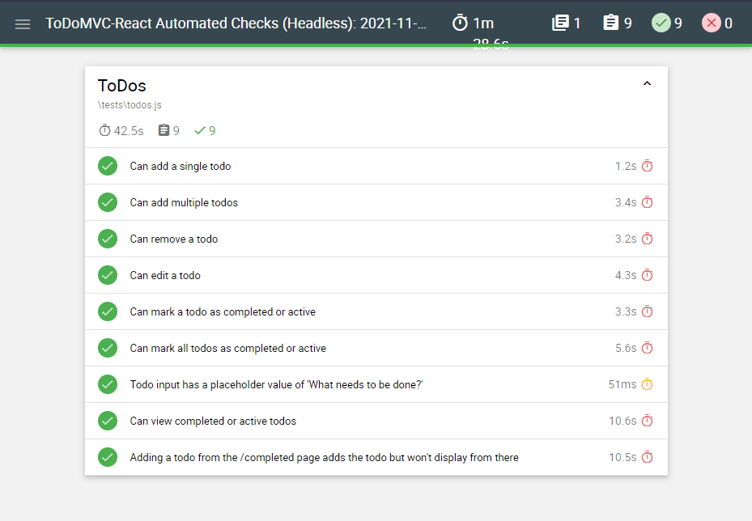
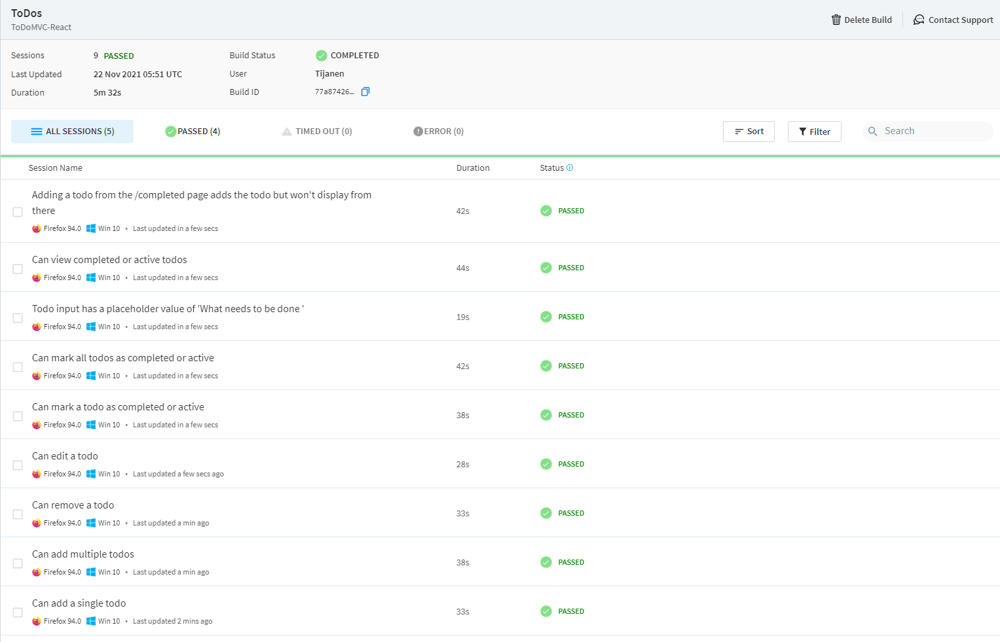

# ToDoMVC React Automated Checks using Javascript and CodeceptJS

## Running CodeceptJS UI Tests

---

### Locally

1. Open a web browser. Go to the remote code repository (<https://github.com/jasonogayon/autochecks-js-cocedept>) and copy its SSH or HTTPS link.

2. On your machine, open a terminal and clone the remote repository locally wherever you want. Run `git clone git@github.com:jasonogayon/autochecks-js-cocedept.git`.

3. After that, go inside the cloned **autochecks-js-cocedept** repository. You can decide to rename this directory to what you want.

4. Now we can try to run our CodeceptJS tests locally on our machine. They will of course fail first because we have not yet installed our code dependencies. Run `yarn run test:local` or `make ui`.

5. So install the dependencies. Run `yarn install`.

6. After that, we can try to run our tests again and see if they proceed. Run `yarn run test:local` or `make ui` again.

7. The tests does not run because in order to run CodeceptJS tests locally, we have to first install Selenium-Standalone server and drivers locally on our project. Install by running `npx selenium-standalone install`.

8. Once those are installed, we can now run the tests again, without a hitch this time.

---

### On Browserstack

1. To run CodeceptJS tests on Browserstack, the same initial setup in the locally steps apply. Follow the steps until you have the remote cope repository cloned and the dependencies installed.

2. When that's done, we can now try to run our tests on Browserstack. This will fail, because we have not yet properly set up our Browserstack credentials. Run `yarn run test:browserstack` or `make bs`.

3. To set up our Browserstack crendetials, we need to open up a text editor and create an **.env** file inside the root of our repository. You can just copy the **.env.example** file and rename the copied file to **.env**. If you have an existing file, then you can copy the values from the example.

4. In the **.env** file, you'll see that the BROWSERSTACK_USER and BROWSERSTACK_KEY values are set to *user* and *key* by default. These are not actual Browserstack account credentials so you have to get the retrieve the credentials from the Browserstack account where you want to run your tests.

5. When you find those credentials from your BrowserStack account, copy them and update the **.env** file.

6. After that, the CodeceptJS tests should now run on Browserstack. Run `yarn run test:browserstack` or `make bs`.

---

### Reports

Running the CodeceptJS tests locally or browserstack each generate its own separate report after each complete run. You can find the reports inside the **output** directory.

They are in HTML format and the filenames are in a format that includes the date of the test run as well as whether the run occured locally or on Browserstack.

Below is a screenshot of a sample Browserstack test run:

---

Author: Jason B. Ogayon
Software Engineer and Software Tester
